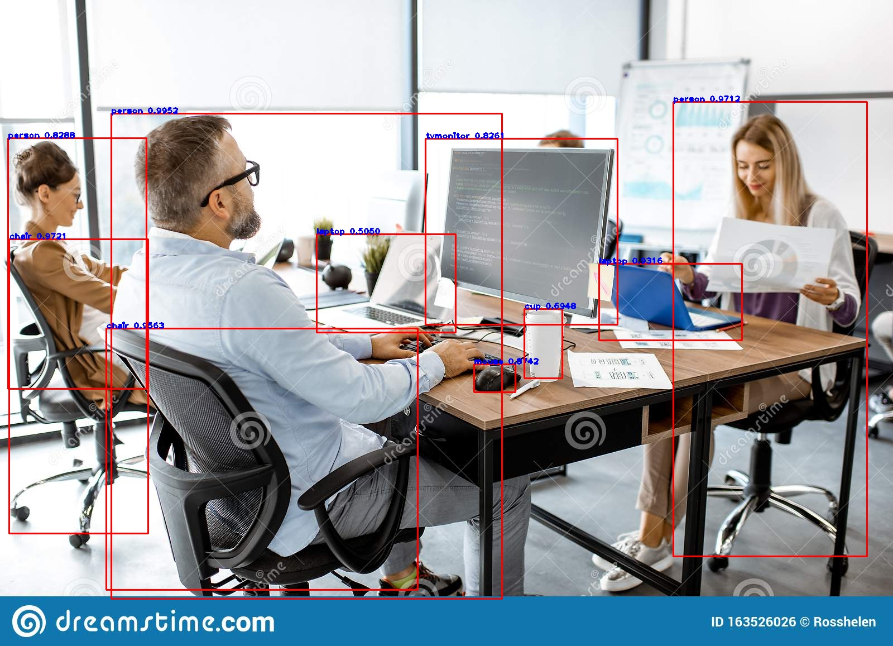

# YOLO_v3_tutorial
This tutorial is about creating an API using FLASK for an image recognition task by YOLOv3 algorithm

It is important to know the codes of this Doc were writen by tensorflow with the help of keras API. As you know in Computer vision we have a strong library of OpenCV, therefore I have tried to write the same algorithm (yolov3) by using this library too. You can access it in [this link](https://github.com/sheydabahrami)

For understanding codes you can use these references:

https://machinelearningspace.com/yolov3-tensorflow-2-part-1/

https://machinelearningspace.com/yolov3-tensorflow-2-part-2/

https://machinelearningspace.com/yolov3-tensorflow-2-part-3/

https://machinelearningspace.com/yolov3-tensorflow-2-part-4/

NOTE: image.py is the API for the model, and image-Copy.py is the base model. 

Here's the output example:

In order to depoly your model on clouds (heroku and others) it is better to use pigar for saving requirments rather than pip freeze.
